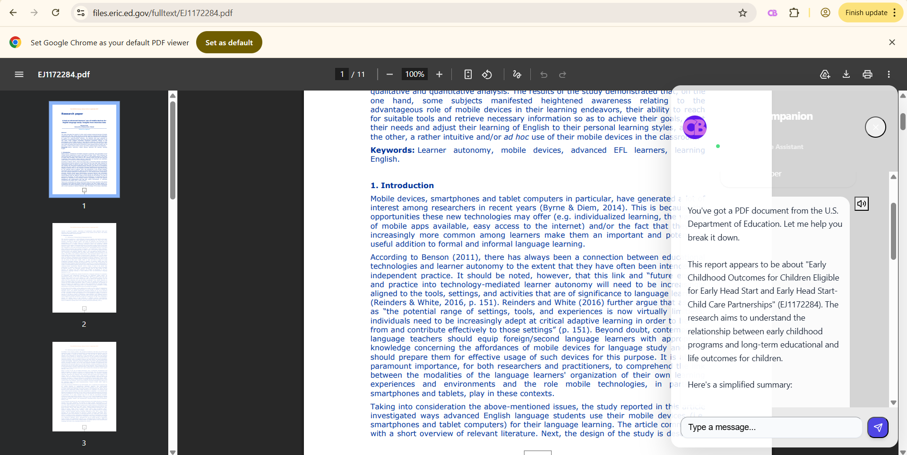

# Browser Companion: Your AI-Powered Guide to the Web

**Browser Companion** is a versatile Chrome extension that simplifies your interactions with any website. Whether you're navigating complex government services,reading research papers, filling out forms, posting on social media, or managing cloud platforms ,or performing any task on browser, Browser Companion provides translations, explanations, and step-by-step guidance to make your web experience seamless.

## Key Features

- **Universal AI Assistance:** Get instant answers and guidance on any website, from social media to cloud consoles.
- **Form Filling & Validation:** Identify form fields and get intelligent suggestions to help you complete them accurately.
- **Step-by-Step Guidance:** Navigate complex processes with clear instructions and translations.
- **Contextual Awareness:** Receive relevant information and support based on the specific page you're viewing.
- **FAQ and Knowledge Base:** Access answers to common questions and learn about essential processes.
- **History Dashboard:** Review your past interactions and track your progress across different sites.
- **Customizable Settings:** Adjust response tone and choose your preferred AI provider (Together AI, Groq, etc.).

## Installation

1. Clone this repository: `git clone https://github.com/mohdlatif/Clear-Bureau.git`
2. Open Chrome and navigate to `chrome://extensions/`
3. Enable "Developer mode" in the top right corner.
4. Click "Load unpacked" and select the `build` directory.

## Usage

1. Once installed, the Browser Companion icon will appear in your browser toolbar.
2. Click the icon to open the chat widget on any website.
3. Ask questions, request guidance, or use specialized tools like **Simplify** and **Summarize**.

## Technology Stack

- **Frontend:** HTML, CSS, JavaScript, React
- **Backend:** Python, Flask, Restack, Llama 3.2, LlamaIndex
- **Database:** MindsDB, Postgres (under development)

## How it Works

Browser Companion uses advanced AI to simplify your web interactions. When you ask a question or request guidance, it:

1. **Analyzes the Webpage:** Extracts relevant information and structure from the current webpage.
2. **Sends API Request:** Sends your request and the page context to the AI backend.
3. **Processes with Llama:** Uses Llama 3.2 (via Together AI or Groq) to understand your request and generate a response.
4. **Accesses Knowledge Base:** Retrieves relevant information from a curated knowledge base of FAQs and common processes.
5. **Provides Assistance:** Delivers clear instructions, translations, or answers in your preferred language and tone.

## Addressing the Hackathon Challenge

Browser Companion addresses the challenge of navigating the digital world by:

- **Breaking down complexity:** Providing simple explanations for technical and bureaucratic jargon.
- **Improving productivity:** Helping users fill forms and post on social media more efficiently.
- **Enhancing accessibility:** Making complex platforms and services more user-friendly for everyone.

## Future Roadmap

- **Enhanced Form Automation:** One-click form filling based on user profile.
- **Social Media Integration:** Direct posting capabilities for major platforms.
- **Cloud Platform Templates:** Pre-built guides for common cloud management tasks.
- **Voice Interaction:** Improved natural conversation experience.

## Acknowledgements

- **Llama 3.2:** https://ai.meta.com/blog/llama-3-2-connect-2024-vision-edge-mobile-devices/
- **Together AI:** https://www.together.ai/
- **Groq:** https://groq.com/
- **Restack:** https://www.restack.io/
- **LlamaIndex:** https://www.llamaindex.ai/

---
